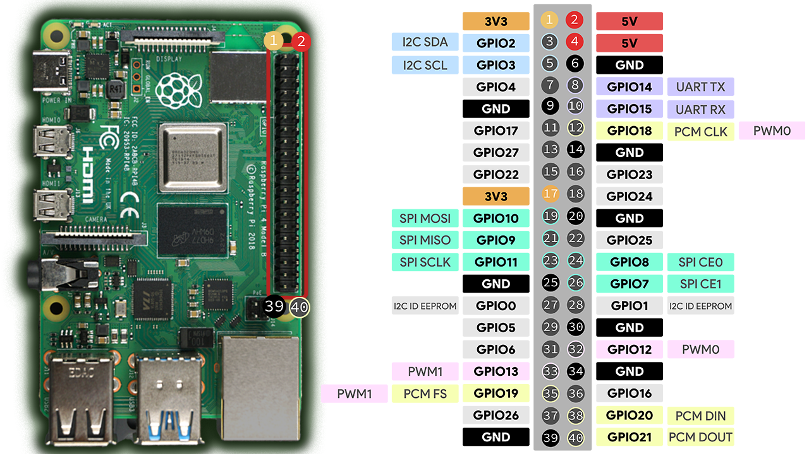

Getting CAN to work with a raspberry pi is a little bit more complicated than it is to get working with an arduino.
I am following this tutorial to get it to work. Luckily, linux comes shipped with a SocketCAN driver for the mcp2515 chip, which we are using.

These instructions only needed to be followed one time per raspberry pi. 

https://www.beyondlogic.org/adding-can-controller-area-network-to-the-raspberry-pi/
https://linuxjedi.co.uk/2021/12/01/making-a-can-bus-module-work-with-a-raspberry-pi/comment-page-1/
https://www.beyondlogic.org/adding-can-controller-area-network-to-the-raspberry-pi/

Arduino CAN library docs: https://github.com/coryjfowler/MCP_CAN_lib

To check if the driver worked:
dmesg | grep can0

We also have to get the CAN library to work with arduino. The arduino code is built using platformIO, so we use that 
to sort out the dependencies.

VERY, VERY IMPORTANT NOTE:

All devices must share a common ground! Also, spi is quite finnicky regarding wire length and interference, 
so it is very important these devices are soldered together. If you are experiencing troubles, try rewiring.